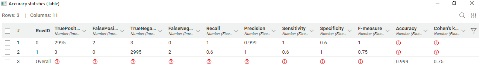

# Suspicious Transaction Detection (AML)

This repository contains an end-to-end analytical workflow for detecting suspicious financial transactions associated with money laundering (AML). The project combines Python preprocessing with a low-code/no-code modeling pipeline in KNIME to identify high-risk patterns and evaluate supervised machine learning models using a realistic synthetic dataset.

## Overview

Money laundering remains a critical challenge for financial institutions due to limited access to labeled data, evolving criminal typologies, and the inefficiency of traditional monitoring systems. This project addresses these issues by leveraging synthetic transactional data and modern analytical tools to build a scalable solution for AML detection.

## Dataset

**Dataset:** SAML-D (Synthetic AML Dataset)  
**Source:** Kaggle — “Synthetic Transaction Monitoring Dataset - AML”
[Synthetic Transaction Monitoring Dataset - AML (Kaggle)](https://www.kaggle.com/datasets/berkanoztas/synthetic-transaction-monitoring-dataset-aml)

- More than 9.5M transactions, with only 0.1039% labeled as suspicious  
- Contains 28 transaction typologies (11 normal, 17 suspicious)  
- Designed based on interviews with AML specialists and academic research  
- A preprocessed sample of 10,000 transactions was used for modeling

## Methodology

### Tools
- Python (Pandas) for preprocessing  
- KNIME Analytics Platform for EDA, feature processing, and model training  

### Workflow
1. **Data Preparation:** column filtering, datatype corrections, sampling  
2. **Exploratory Data Analysis (EDA):** distribution analysis, class imbalance inspection, geographic risk patterns, typology insights  
3. **Supervised Models:**  
   - Logistic Regression  
   - Tree Ensemble (Random Forest)  
4. **Evaluation Metrics:** accuracy, recall, precision, F1 score, Cohen’s Kappa  

## Results

### Logistic Regression   
- Accuracy: ~99.99%  
- Recall: 0.60  
- Precision: 1.00  
- F1 score: 0.75

### Tree Ensemble (Random Forest)
- Detects 80% of true suspicious transactions  
- F1 score: 0.88  
- Cohen’s Kappa: ~0.889  
- Preferred model due to robustness and ability to capture complex transaction behaviors  

## Impact

- Improves early detection of suspicious activity through automated, high-precision models  
- Delivers interpretable, data-driven insights for compliance and risk teams  
- Scalable for potential real-time monitoring applications  
- Supports open-source AML research with accessible synthetic data  
- Aligns with financial regulatory expectations and industry best practices  

## Conclusion

This project demonstrates the feasibility of predicting suspicious transactions using structured data and supervised machine learning models. The combination of Python preprocessing and a KNIME workflow results in a clear, efficient, and adaptable approach for AML monitoring. The Tree Ensemble model showed the strongest performance and is best suited for operational deployment.  

### Setup

#### 1. Install KNIME Analytics Platform
Download from:  
https://www.knime.com/downloads

#### 2. Open the KNIME workflow
- Launch KNIME  
- Go to File > Open Workflow  
- Select the workflow directory inside the cloned project
